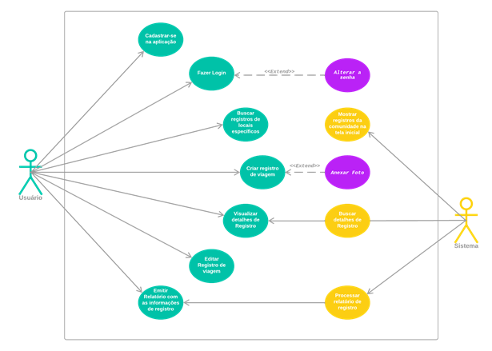
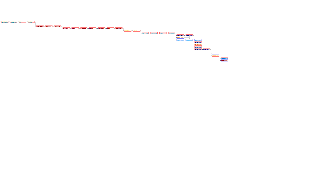
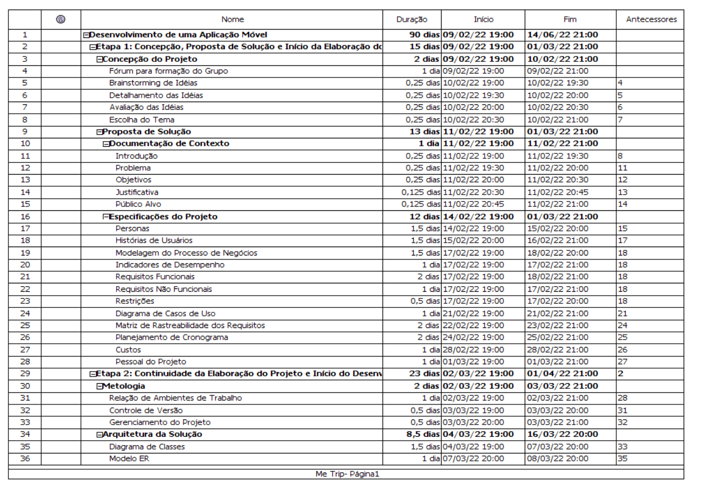
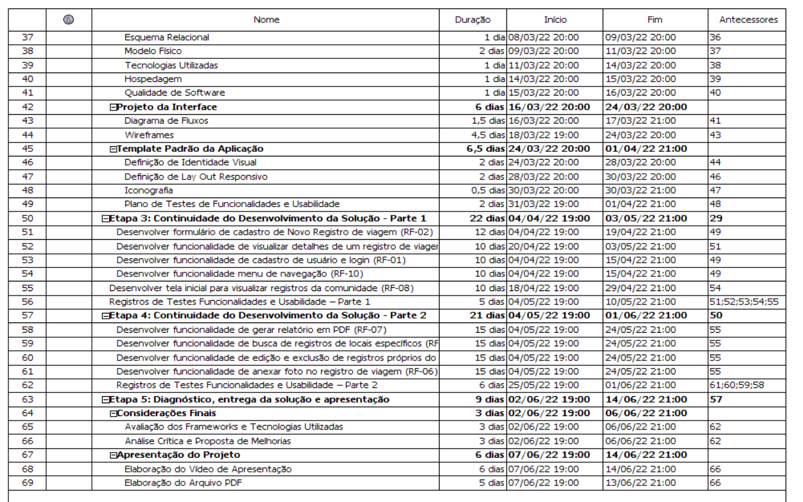
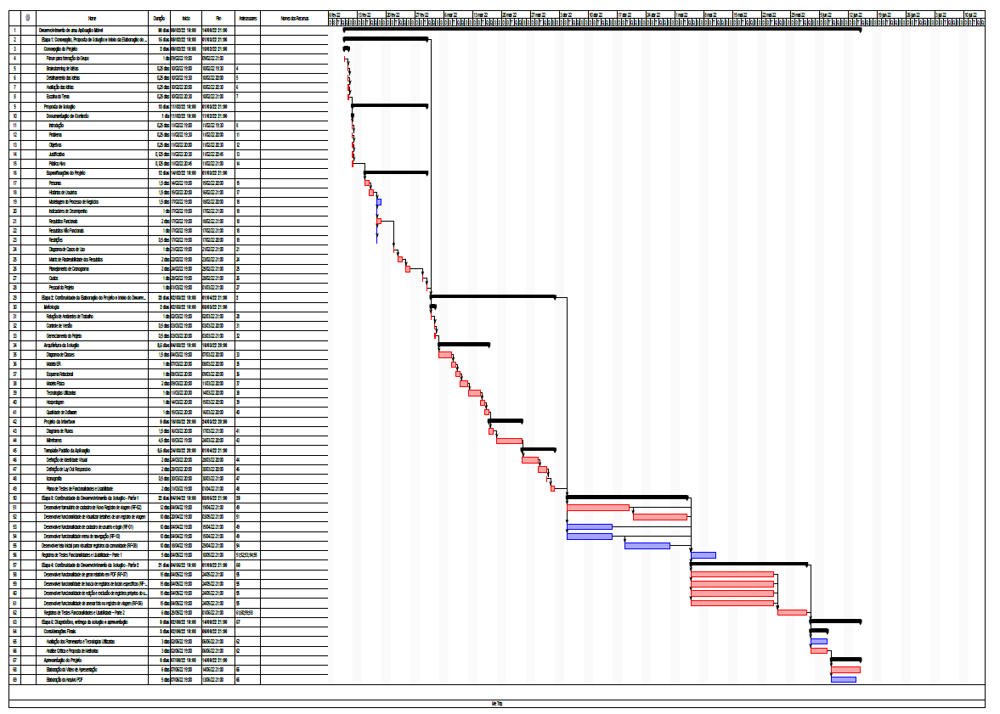
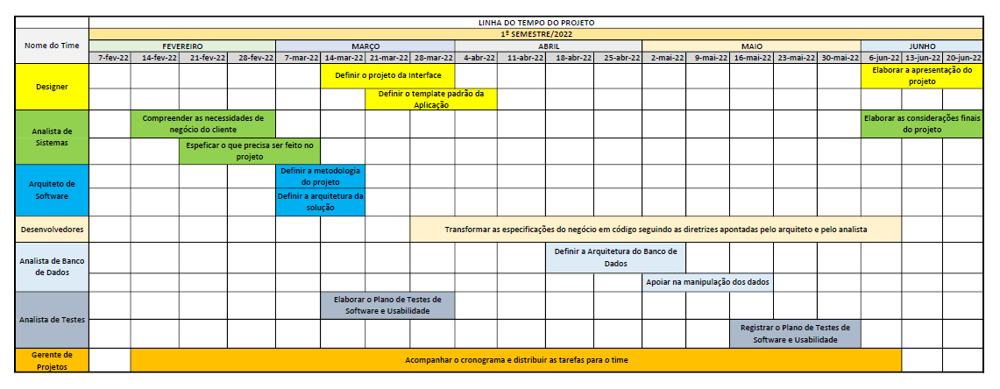

# Especificações do Projeto

Pré-requisitos: <a href="1-Documentação de Contexto.md"> Documentação de Contexto</a>

O propósito de desenvolver esse aplicativo partiu do pressuposto de que não existe um aplicativo de gestão de viagens capaz de suprir as necessidades básicas de viajantes de forma funcional e com o melhor custo-benefício em relação a outras possíveis soluções já existentes no mercado. Para detalhamento das demandas requeridas pelos usuários foram realizadas entrevistas com os verdadeiros amantes de uma estrada.

## Personas

|  | **THÉO GRANJEIRO CAVALHEIRO** |**Localização:** Ubá-MG|
|:---:|:---:|:---:|
||||
| **Idade:** | **Ocupação:** | **Plataforma e APP's utilizados:** |
| 40 anos | Analista de Vendas | Uber; Ifood; Spotify |
||||
| **Motivações:** | **Frustrações:** | **Hobbies, História:** |
| Desejo de conhecer o mundo | Dificuldade em guardar dinheiro | Andar de moto; Viajar; Conhecer pessoas; Assistir canais de viagens. |

|  | **JOANA GALINDO MASCARENHAS** |**Localização:** Cuiabá-MT|
|:---:|:---:|:---:|
||||
| **Idade:** | **Ocupação:** | **Plataforma e APP's utilizados:** |
| 65 anos | Professora de História | Instagram; Netflix; Amazon Prime; Kindle |
||||
| **Motivações:** | **Frustrações:** | **Hobbies, História:** |
| Auto estima para viajar sozinha; Vontade de conhecer o mundo | Depender dos outros | Filmes e séries; Ioga; Ler; Bike. |

|  | **LILIAN CIDREIRA LARANJEIRA** |**Localização:** Americana-SP|
|:---:|:---:|:---:|
||||
| **Idade:** | **Ocupação:** | **Plataforma e APP's utilizados:** |
| 25 anos | Arquiteta | Instagram, Whatsapp; Autocad; Uber; Airbnb; Booking. |
||||
| **Motivações:** | **Frustrações:** | **Hobbies, História:** |
| Conhecer as diferentes arquiteturas e culturas | Visitar uma cidade histórica e ver que sua cultura foi perdida | Academia; Cursos e palestras; Fotografia; Séries. |

|  | **MARCOS TEIXEIRA** |**Localização:** Recife-PE|
|:---:|:---:|:---:|
||||
| **Idade:** | **Ocupação:** | **Plataforma e APP's utilizados:** |
| 61 anos | Advogado | Whatsapp; Uber; Ifood; |
||||
| **Motivações:** | **Frustrações:** | **Hobbies, História:** |
| Fazer viagens pelo Brasil | A perda de sua esposa que lhe acompanharia nesta aventura | Marcenaria DIY; Cursos e palestras; fotofrafia; caminhada. |

|  | **RICARDO FELICIANO** |**Localização:** Florianópolis-SC|
|:---:|:---:|:---:|
||||
| **Idade:** | **Ocupação:** | **Plataforma e APP's utilizados:** |
| 35 anos | Autônomo | Instagram; Whatsapp; Facebook; Uber; Ifood; Booking |
||||
| **Motivações:** | **Frustrações:** | **Hobbies, História:** |
| Fazer o que mais gosta; Gosta de aventura | A perda do seu cachorro que lhe acompanhava em todas as suas viagens | Surfar; Dirigir; Fotografia; Corrida de rua. |

|  | **JOÃO PAULO** |**Localização:** Vila Velha-ES|
|:---:|:---:|:---:|
||||
| **Idade:** | **Ocupação:** | **Plataforma e APP's utilizados:** |
| 38 anos | Bibliotecário | Instagram; Whatsapp; Uber; Ifood; Handtalk |
||||
| **Motivações:** | **Frustrações:** | **Hobbies, História:** |
| Mais independência nas viagens | Sofre de mudez (incapacidade total de produzir falas); Não consegue se comunicar durante as viagens | Leitura; Cinema; Academia; Viagens |

> **Links Úteis**:
> - [Rock Content](https://rockcontent.com/blog/personas/)
> - [Hotmart](https://blog.hotmart.com/pt-br/como-criar-persona-negocio/)
> - [O que é persona?](https://resultadosdigitais.com.br/blog/persona-o-que-e/)
> - [Persona x Público-alvo](https://flammo.com.br/blog/persona-e-publico-alvo-qual-a-diferenca/)
> - [Mapa de Empatia](https://resultadosdigitais.com.br/blog/mapa-da-empatia/)
> - [Mapa de Stalkeholders](https://www.racecomunicacao.com.br/blog/como-fazer-o-mapeamento-de-stakeholders/)

## Histórias de Usuários

Tendo em vista as entrevistas realizadas com esse público-alvo, podemos anotar as seguintes histórias dos usuários:

|EU COMO... `PERSONA`| QUERO/PRECISO ... `FUNCIONALIDADE` | DÚVIDAS |PARA ... `MOTIVO/VALOR`                 |
|--------------------|------------------------------------|---------|----------------------------------------|
| Théo Cavalheiro | Fazer um tour com a namorada por vários países do mundo. | Não sabe como encontrar locais satisfatórios com bom custo-benefício. | Se distrair da rotina cansativa e repetitiva sempre nos mesmos locais. |
| Joana Mascarenhas | Fazer viagens sozinha para locais históricos. | Não sabe como planejar uma viagem e precisa de recomendações de estadia e alimentação. | Aumentar a sua independência pessoal e conhecimento teórico. |
| Lilian Laranjeira | Visitar construções exóticas ao redor mundo inteiro. | Não sabe onde verificar avaliações mais completas sobre os locais que deseja visitar. | Expandir o leque de possibilidades de seu trabalho com novas referências arquitetônicas. |
| Marcos Teixeira | Fazer uma turnê pelo país. | Dúvida de onde encontrar boas recomendações na internet de hotéis e Restaurantes. | Ampliar sua rede de contatos com outros influencers e ter contato com os seguidores. |
| Ricardo Feliciano | Viajar pelo pantanal Brasileiro. | Quer Saber mais sobre esse ponto turístico. | Cumprir o seu objetivo de viajar Todos os pontos turísticos do Brasil. |
| João Paulo | Adquirir mais independência nas viagens | Por sofrer de Mudez total, não consegue se comunicar durantes as viagens. | Aumentar sua independência nas viagens, sem depender da informação de terceiros nas ruas. |

> **Links Úteis**:
> - [Histórias de usuários com exemplos e template](https://www.atlassian.com/br/agile/project-management/user-stories)
> - [Como escrever boas histórias de usuário (User Stories)](https://medium.com/vertice/como-escrever-boas-users-stories-hist%C3%B3rias-de-usu%C3%A1rios-b29c75043fac)
> - [User Stories: requisitos que humanos entendem](https://www.luiztools.com.br/post/user-stories-descricao-de-requisitos-que-humanos-entendem/)
> - [Histórias de Usuários: mais exemplos](https://www.reqview.com/doc/user-stories-example.html)
> - [9 Common User Story Mistakes](https://airfocus.com/blog/user-story-mistakes/)

## Modelagem do Processo de Negócio 

### Análise da Situação Atual

Cada vez as pessoas buscam conveniência, facilidade,  qualidade e valor nos aplicativos. Em um cenário de constantes viagens, o controle das informações torna-se cada vez mais importante para termos um histórico dos locais visitados e avaliar. Um aplicativo mobile para gestão destas informações é fundamental para o viajante registrar, avaliar, acessar e compartilhar suas experiências de viagem. Este projeto oferecerá uma grande oportunidade para esse público criar um diário de suas viagens de forma rápida, simples e eficaz. 
Atualemnte o mercado apresenta soluções separadas por exemplo, aplicativos somente de hospedagens ou aplicativos de restaurantes, não há aplicativos com todas as informações disponveis em um unico aplicativo.

Apresente aqui os problemas existentes que viabilizam sua proposta. Apresente o modelo do sistema como ele funciona hoje. Caso sua proposta seja inovadora e não existam processos claramente definidos, apresente como as tarefas que o seu sistema pretende implementar são executadas atualmente, mesmo que não se utilize tecnologia computacional. 

### Descrição Geral da Proposta

Apresente aqui uma descrição da sua proposta abordando seus limites e suas ligações com as estratégias e objetivos do negócio. Apresente aqui as oportunidades de melhorias.

### Processo 1 – NOME DO PROCESSO

Apresente aqui o nome e as oportunidades de melhorias para o processo 1. Em seguida, apresente o modelo do processo 1, descrito no padrão BPMN. 

### Processo 2 – NOME DO PROCESSO

Apresente aqui o nome e as oportunidades de melhorias para o processo 2. Em seguida, apresente o modelo do processo 2, descrito no padrão BPMN.

## Indicadores de Desempenho

| # |Indicador | Objetivos |  Descrição |  Cálculo | Fonte dados |  Perspectiva|  
|---|-----------|----------|-------------|---------|------------|-----------------------|
| 1 | Satisfação do cleinte | Verificar a satisfação do app |Quantidade de usuários que manteve o app instalado por um determinado período de tempo após o download. |  Porcentual de aplicativos instalados por determinado periodo| Playstore | Clientes |
| 2 | Visibilidade | Verificar a disponibilidade e visibilidade nas lojas de apps  |  Por meio do ranking verificar a disponibilidade do aplicativo nas lojas em que ele está disponível | Posicionamento em relação às palavras-chave que ele se relaciona; Quantidade de usuários que visitam a página do aplicativo; Posição no ranking de sua categoria | Playstore| Gestor de negócios |
| 3 |  Desinstalações  | Avaliar o que pode ser modificado no app, o que não está agradando ou o que está faltando |  Fornece informações importantes para insights de novas estratégias de marketing do app  | Quantidade de desinstalações  por um determinado periodo| Playstore | Clientes insatisfeitos |
| 4 | Engajamento | Medir o sucesso do aplicativo | Fatores que podem influienciar o engajamento |Tempo de permanência na utilização do Metrip, quantidade de vezes que é aberto, quantas interações com o app |  software |  |
| 5 | nº de download  |  Medir quantidade de download  |  Quantidade de download feito na loja de app. | Quanto mais downloads, mais clientes tiveram contato com o Metrip |  Playstore  |   |

 

## Requisitos

O escopo funcional do projeto é definido por meio dos requisitos funcionais que descrevem as possibilidades interação dos usuários, bem como os requisitos não funcionais que descrevem os aspectos que o sistema deverá apresentar de maneira geral. Estes requisitos são apresentados a seguir:

As tabelas que se seguem apresentam os requisitos funcionais e não funcionais que detalham o escopo do projeto. Para determinar a prioridade de requisitos, aplicar uma técnica de priorização de requisitos e detalhar como a técnica foi aplicada.

### Requisitos Funcionais

A tabela 02 a seguir apresenta os requisitos do projeto, identificando a prioridade em que os mesmos devem ser entregues.

Tabela 02: descrição dos requisitos funcionais.
|ID    | Descrição do Requisito  | Prioridade |
|------|-----------------------------------------|----|
|RF-001| O aplicativo deve permitir ao usuário cadastrar-se com um login e senha. | ALTA | 
|RF-002| O app deve conter um formulário para criação de registro de viagem.   | ALTA |
|RF-003| O app deve permitir visualizar detalhes dos registros criados. | BAIXA |
|RF-004| O app deve permitir editar os dados dos registros criados. | BAIXA |
|RF-005| O app deve permitir excluir os dados dos registros criados. | BAIXA |
|RF-006| O app deve permitir ao usuário anexar uma foto para complementar o cadastro de um registro de viagem. | BAIXA |
|RF-007| O app deve permitir a emissão de um relatório com as informações. | MÉDIA |
|RF-008| O app deve mostrar registros criados por outras pessoas na tela inicial. | MÉDIA |
|RF-009| O app deve permitir ao usuário buscar registros de locais específicos. | BAIXA |
|RF-010| O app deve conter um menu de navegação com indexação para as telas. | BAIXA |

### Requisitos não Funcionais

A tabela 03 a seguir apresenta os requisitos não funcionais que o projeto deverá atender.

Tabela 03: descrição dos requisitos não funcionais.
|ID     | Descrição do Requisito  |Prioridade |
|-------|-------------------------|----|
|RNF-001| O aplicativo deverá apresentar um layout padrão para todas as telas, podendo ser criado ou utilizado um existente. | ALTA | 
|RNF-002| O aplicativo deverá ser responsivo, permitindo a visualização em um celular de forma adequada. |  MÉDIA |
|RNF-003| O aplicativo deverá ter uma fonte padrão para todas as escritas, com alterações apenas no tamanho. | MÉDIA |
|RNF-004| A aplicação deve ser intuitiva, de fácil utilização e entendimento, descartando a necessidade de treinamentos. | MÉDIA |
|RNF-005| A aplicação deve ser compatível com as últimas versões dos sistemas operacionais do Android e IOS. | MÉDIA |
|RNF-006| A aplicação deve possuir uma interface limpa, contendo somente elementos que serão utilizados naquela tela.| BAIXA |
|RNF-007| A aplicação deve ser disponibilizada por meio das principais lojas de aplicativo do mercado (Google Play, ITunes, etc...). | BAIXA |

Com base nas Histórias de Usuário, enumere os requisitos da sua solução. Classifique esses requisitos em dois grupos:

Lembre-se que cada requisito deve corresponder à uma e somente uma
característica alvo da sua solução. Além disso, certifique-se de que
todos os aspectos capturados nas Histórias de Usuário foram cobertos.

## Restrições

As questões que limitam a execução desse projeto e que se configuram como obrigações claras para o desenvolvimento do projeto em questão são apresentadas na tabela 04 a seguir.

Tabela 04: descrição das restrições.
|ID| Restrição                                             |
|--|-------------------------------------------------------|
|RE-001| O projeto deverá ser entregue no final do semestre letivo, não podendo extrapolar a data de 22/06/2022. |
|RE-002| O aplicativo deve se restringir às tecnologias de desenvolvimento mobile. |
|RE-003| A equipe não pode subcontratar o desenvolvimento do trabalho. |

## Diagrama de Casos de Uso

O diagrama de casos de uso é o próximo passo após a elicitação de requisitos, que utiliza um modelo gráfico e uma tabela com as descrições sucintas dos casos de uso e dos atores. Ele contempla a fronteira do sistema e o detalhamento dos requisitos funcionais com a indicação dos atores, casos de uso e seus relacionamentos. 

# Matriz de Rastreabilidade

A matriz de rastreabilidade é uma ferramenta usada para facilitar a visualização dos relacionamento entre requisitos e outros artefatos ou objetos, permitindo a rastreabilidade entre os requisitos e os objetivos de negócio. 

A matriz abaixo contemplar todos os elementos relevantes que fazem parte do sistema, conforme apresentada a seguir.

||RF1|RF2|RF3|RF4|RF5|RF6|RF7|RF8|RF9|RF10|RNF1|RNF2|RNF3|RNF4|RNF5|RNF6|RNF7|UC1|UC2|UC3|UC4|UC5|UC6|UC7|TC1|TC2|TC3|TC4|TC5|TC6|TC7|
|---|---|---|---|---|---|---|---|---|---|---|---|---|---|---|---|---|---|---|---|---|---|---|---|---|---|---|---|---|---|---|---|
|Viajantes|X|X|X|X|X|X|X|X|X|X||||||||||||||||||||||
|RF1|||||||||||X|X|X|X||X||X|X||||||X|X|X|||||
|RF2|||||||||||X|X|X|X||X|||||X||||||||||X|
|RF3|||||||||||X|X|X|X||X||||||X||||||||X||
|RF4|||||||||||X|X|X|X||X|||||||X|||||||X||
|RF5|||||||||||X|X|X|X||X|||||||X|||||||X||
|RF6|||||||||||X|X|X|X||X|||||X||||||||||X|
|RF7|||||||||||X|X|X|X||X||||||||X||||||X||
|RF8|||||||||||X|X|X|X||X|||||||||||||X|||
|RF9|||||||||||X|X|X|X||X||||X||||||||||X||
|RF10|||||||||||X|X|X|X||X||||||||||||X||||

# Gerenciamento de Projeto

De acordo com o PMBoK v6 as dez áreas que constituem os pilares para gerenciar projetos, e que caracterizam a multidisciplinaridade envolvida, são: Integração, Escopo, Cronograma (Tempo), Custos, Qualidade, Recursos, Comunicações, Riscos, Aquisições, Partes Interessadas. Para desenvolver projetos um profissional deve se preocupar em gerenciar todas essas dez áreas. Elas se complementam e se relacionam, de tal forma que não se deve apenas examinar uma área de forma estanque. É preciso considerar, por exemplo, que as áreas de Escopo, Cronograma e Custos estão muito relacionadas. Assim, se eu amplio o escopo de um projeto eu posso afetar seu cronograma e seus custos.

## Gerenciamento de Tempo

Com diagramas bem organizados que permitem gerenciar o tempo nos projetos, o gerente de projetos agenda e coordena tarefas dentro de um projeto para estimar o tempo necessário de conclusão.

O gráfico de Gantt ou diagrama de Gantt também é uma ferramenta visual utilizada para controlar e gerenciar o cronograma de atividades de um projeto. Com ele, é possível listar tudo que precisa ser feito para colocar o projeto em prática, dividir em atividades e estimar o tempo necessário para executá-las.

## Gerenciamento de Equipe

O gerenciamento adequado de tarefas contribuirá para que o projeto alcance altos níveis de produtividade. Por isso, é fundamental que ocorra a gestão de tarefas e de pessoas, de modo que os times envolvidos no projeto possam ser facilmente gerenciados. 

## Gestão de Orçamento

O processo de determinar o orçamento do projeto é uma tarefa que depende, além dos produtos (saídas) dos processos anteriores do gerenciamento de custos, também de produtos oferecidos por outros processos de gerenciamento, como o escopo e o tempo.

|   |**Orçamento**|   |
|---|-------------|---|
|**Recursos**|**Quantidade**|**Valor**|
|Recursos Humanos|06|R$ 18.000,00|
|Hardware|06|R$ 7.500,00|
|Rede|06|R$ 3.000,00|
|Softwares|06|R$600,00|
|Serviços|06|R$ 1.500,00|
||**Total**|R$ 30.600,00|

*Memória de Cálculo*

- **Recursos Humanos** = 6 pessoas x R$ 50,00/Hora x 60 Horas = R$ 18.000,00 

- **Hardware** = locação 6 Notebooks x R$ 250,00/Mês x 5 Meses = R$ 7.500,00 

- **Rede** = 6 internet banda larga x R$ 100,00/Mês x 5 Meses = R$ 3.000,00 

- **Softwares** = locação de 6 (windows, office) x R$ 20,00/Mês x 5 Meses = R$ 600,00 

- **Serviços** = 6 despesas (energia, hospedagem) x R$ 50,00/Mês x 5 Meses = R$ 1.500,00 
