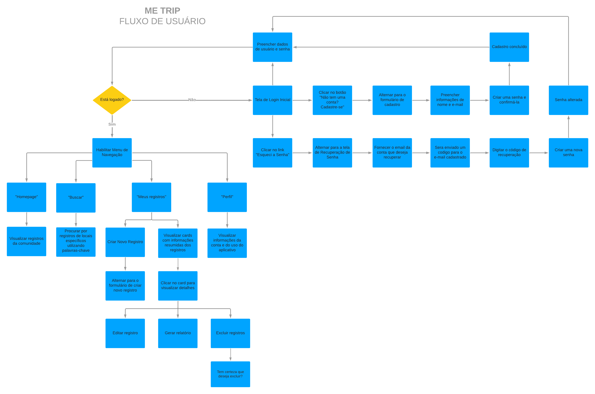

# Projeto de Interface

Pré-requisitos: <a href="2-Especificação do Projeto.md"> Documentação de Especificação</a>

A elaboração da interface do sistema foi cuidadosamente desenvolvida para proporcionar maior conforto ao usuário e para isso estamos estabelecendo foco em acessibilidade, usabilidade e agilidade. Além disso, todas as telas são projetadas para funcionamento em dispositivos mobile.

## Diagrama de Fluxo

Conforme pode ser visto, a *Figura X* mostra o diagrama de fluxo de interação do usuário pelas telas do sistema. Cada uma das telas deste fluxo é detalhada na seção de Wireframes que será desenvolvido. 

|FLUXO DO USUÁRIO| DESCRIÇÃO | RF |
|--|-------------------------------------------------------|----------------------|
|Autenticar na aplicação|Primeiro contato visual do usuário ao instalar e abrir a aplicação, é por meio desse fluxo que o usuário faz login, se cadastra e solicita alteração de senha.|RF-001|
|Cadastrar-se na aplicação | Ao decidir se cadastrar na aplicação, o usuário deve forncecer algumas informações e criar uma senha para posteriormente entrar no aplicativo.  |RF-001 |
|Navegar pelas Telas|A aplicação possui 4 telas que podem ser acessadas pelo menu de navegação: 'Comunidade', 'Buscar', 'Meus Registros' e 'Perfil' |RF-010 |
|Cadastrar registro de Viagem|O usuário pode registrar informações sobre uma viagem realizada por ele|RF-002|
|Visualizar registro de Viagem|É permitido ao usuário visualizar detalhes de registros de viagem da comunidade e também próprios|RF-003|
|Editar Registro de Viagem|É permitido ao usuário fazer alterações em um registro de viagem criado por ele mesmo|RF-004|

 Figura X – Fluxograma do Usuário MeTrip 
 
## Wireframes

Conforme fluxo de usuário do projeto amostrado no item anterior, as telas do sistema logado são apresentadas em detalhes nos itens que se seguem. Todas essas telas têm uma estrutura comum que é apresentada na Figura X. Nesta estrutura, os elementos sãao organizados em 3 seções, descritos a seguir. São elas:

- **Cabeçalho** - local onde são dispostas as informações de identificação da tela (título e icon);   
- **Conteúdo** - apresenta o conteúdo da tela em questão;   
- **Barra de Navegação** - Apresenta o menu da aplicação que permite navegar pelas páginas.

 

  
 

 Figura X – Estrutura padrão do site 
 
 ## LandingPage / Login
 
A landing page contém a logo do projeto ao iniciar a aplicação e caso o usuário não esteja logado, ela o direciona para a tela de Login, que permite entrar no sistema, se cadastrar como um novo usuário ou alterar a senha caso a tenha esquecido. Podemos conferir a estrutura de ambas as páginas, conforme *Figura X*, listada abaixo:
 

  
 

 Figura X – Landing page e tela de Login 
 
 ## Fluxo de Telas - Cadastro de Usuário
 O fluxo de *Cadastro de Usuário* ilustrado na *Figura X* permite ao usuário se cadastrar na aplicação caso este ainda não possua uma conta, seguindo um formulário solicitando informações obrigatórias de acordo com o tipo de perfil a ser criado.
 

  
 

 Figura X –  Fluxo de Cadastro de Usuário.
 
 ## Fluxo de Telas - Esqueci a Senha
 Caso o usuário já possua uma conta mas não saiba sua senha, é permitido que ele altere sua senha por meio do fluxo apresentado na *Figura X*. 
 

  
 

 Figura X – Fluxo de Telas de Redefinição de Senha.
 
 
 ## Telas presentes no Menu
 Ao fazer login na aplicação, a barra de navegação inferior é exibida, e esta permite ao usuário navegar entre as quatro telas principais da aplicação, conforme descrito no requisito funcional RF-010. As telas 'Comunidade', 'Buscar', 'Meus Registros' e 'Perfil' podem ser conferidas na *Figura X*, apresentada a seguir:
 
 

  
 

 Figura X – Telas que são acessadas pela barra de navegação.
 
 ## Cadastrar Registro de Viagem
 Como a função principal definida pelo projeto no requisito funcional RF-002 se trata de permitir ao usuário registrar suas viagens, surge a necessidade de represnetar em tela essa funcionalidade. Isso será feito por meio de um formulário coeso e intuitivo, conforme pode ser observado na *Figura X*:
 

  
 

 Figura X – Criação de novo Registro de Viagem
 
 ## Visualizar Registro de Viagem
 Para garantir o cumprimento de dois importantes requisitos funcionais, o RF-003 e RF008, foi estruturado um modelo de tela para visualizar em detalhes um registro criado pelo usuário e também os de outras pessoas da comunidade. No caso de um registro próprio, é por meio dessa tela que o usuário consegue acionar as funcionalidades para editar aquele registro, gerar um relatório em PDF com as informações contidas e também excluí-lo permanentemente. Essas funções mencionadas podem ser acessadas por meio de um botão flutuante de ação, conforme a *Figura X*, apresentada abaixo:
 

  
 

 Figura X – Visualização de Registro de Viagem
 
 ## Editar Registro de Viagem
 Uma vez criado um registro de viagem, ocasionalmente pode ser que o usuário que o criou deseje editá-lo, por *n* motivos. Sendo assim, também foi pensado em um fluxo para permitir que isso seja possível, conforme exigido no requisito funcional RF-004. O protótipo de visualização do usuário com essa tela pode ser conferido na *Figura X*, mostrada a seguir:
 

  
 

 Figura X – Edição de Registro de Viagem
 
